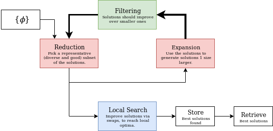

# dc2

**dc2** is a solver for the Uncapacitated Facility Location problem (a.k.a. SPLP) and p-median. It is based on Disperse Construction, a constructive incomplete search method that explores the search space ensuring diversity.

This is the second version of the original [dc_splp](https://github.com/autopawn/dc_splp).

It is mainly composed of:
* **Expansion**: Straightforward method to generate all possible solutions of size `n+1` by adding one facility to solutions size `n`.
* **Filtering**: A method that deletes some of the solutions if they are not worth exploring, i.e. leading to worse solutions that the one from where it originated.
* **Reduction**: A method to select a representative subset of solutions from a given set.
* **Local search**: A method that perform moves on a given solution until no further moves can increase the solution value.
* **Path relinking**: Optionally, the final solutions are combined using Path Relinking.



The search advances using these methods on several iterations, as shown in the previous diagram, until no more solutions are present.

# Usage

Compile the program using `make`
```bash
make
```

Then execute it as follows:

```bash
./bin/dc [FLAGS] {reduction:k} <input> <output>
```

for example:
```
./bin/dc example_problems/cap111.txt out.txt
```
solves the problem on `example_problems/cap111.txt` and saves the solution to `out.txt`.

Normally the default parameters are suitable for getting good solutions, but they can be specified, for example:
```
./bin/dc -t8 -l rank:2000 sdbs+:100 example_problems/cap111.txt out.txt
```

executes the solver using 8 threads with a two step reduction method (first sampling based on `rank`, then `sdbs+` until `100` solutions are reached) and skips local searches.

# Formats supported

The solver currently supports 2 formats, the ORLIB-cap format and the Simple format, specified on the [UflLib benchmark](https://resources.mpi-inf.mpg.de/departments/d1/projects/benchmarks/UflLib/data-format.html).

## ORLIB-cap format

Intended for SPLP problems.

The first line has the amount of facilities and clients of the problem:
```
[n] [m]
```
The next `n` lines consist on the opening cost and capacity each facility.
NOTE: as this solver is meant for uncapacitated location problems, capacities are expected to be left as 0.
```
[capacity] [f_i]
```
The next `2m` lines, `2` for each client, contain:
* The demand (weight) of the client (it's ignored).
* The cost of allocating all that demand (i.e. distance*weight) on each of the facilitites .
```
[w_j]
[d_0j*w_j] [d_1j*w_j] ... [d_(n-1)j*w_j]
```

Example: `n=4`, `m=3`:
```
4 3
0 300
0 400
0 150
0 200
0
130 140 130 100
0
120 100 90 120
0
80 50 140 150
```

## Simple format

Used for SPLP and p-median.

The first line consists on `FILE: ` and a filename.
```
FILE: [filename]
```
The next line contains the number of facilitites, clients, and size restriction:
```
[n] [m] [s_max]
```
The next `n` lines consist on the number of the facility (starting at 1), the opening costs, and the transport cost to each client
```
[i+1] [f_i] [d_i0] [d_i1] ... [d_i(m-1)]
```

Example: `n=4`, `m=3`:
```
FILE: Example.txt
4 3 0
1 300 130 120 80
2 400 140 100 50
3 150 130 90 140
4 200 100 120 150
```

# Parameters

## Flags

The following flags can be used to specify different behaviours:

#### Local search

| Flag | Effect |
| :--- | ------ |
| `-A` | Perform local search on all solutions, not only terminal. |
| `-x` | Don't allow local search to perform movements that change the number of facilities. |
| `-w` | Perform local searches with Whitaker's fast exchange best improvement. <br> **This is the default local search.** |
| `-L` | Perform local searches with first improvement rather than best improvement. <br> **Note**: movements that don't decrease solution size have preference. |
| `-W` | Perform Resende and Werneck's local search, **may be much faster**. <br> Requires preprocessing. <br> Requires O(n*m) memory for each **thread**. |
| `-l` | Don't perform local searches. |

#### Path Relinking

| Flag | Effect |
| :--- | ------ |
| `-P`    | Use path relinking on terminal solutions once.  |
| `-M`    | Use path relinking on terminal solutions until no better solution is found. <br> **NOTE**: Too many solutions may be created, <br> remember to specify PR reduction strategies. |
| `-wP` | Use best improvement strategy as path relinking <br> By default, the same method that local searches is used. |
| `-LP` | Use first improvement strategy as path relinking. <br> By default, the same method that local searches is used. |
| `-WP` | Use Resende and Werneck's local search as path relinking. <br> By default, the same method that local searches is used. |

#### Execution

| Flag | Effect |
| :--- | ------ |
| `-V` | Less verbose mode, don't print information during the execution of the algorithm.  |
| `-r<n>` | Sets the random seed to `n`, so execution is **deterministic** <br> with the same parameters and machine. |
| `-n<n>` | Sets the number of target solutions (1 by default). |
| `-t<n>` | The number of threads to use. |

#### Algorithm parameters

| Flag | Effect |
| :--- | ------ |
| `-R<n>` | Performs `n` restarts, useful with random reduction components. |
| `-B<n>` | Instead of creating every child of each solution, just build `n` at random. <br> This happens before filtering. <br> `-B0` builds `ceil(log2(m/p))` where `p` is the solution size. |
| `-BC`   | Disables increasing the branching factor for the first generations of solutions. <br> This is done to compensate that the inital pool has size 1. |
| `-f<n>` | The filter level, can range from 0 to 4: <br> `-f0`: don't filter any solution. <br> `-f1`: solution should be better than the empty solution. <br> `-f2`: solution should be better than its worst parent. <br> `-f3`: solution should be better than its best parent (default). <br> `-f4`: solution should be better than any possible parent |
| `-s<n>` | Sets the minimum size to `n`. <br> Solutions of smaller size are not considered as results. <br> Local search is not performed on them. |
| `-S<n>` | Sets the maximum size to `n`. <br> Once it is reached, the iteration stops.

## Reduction strategies

The reduction is performed chaining one or more reduction strategies. These reduction strategies vary in the results they may have, memory and time complexity.

The default reduction strategy is:
```
rand1:3000 sdbs+:100:pcd _best:200
```
which, on each generation, picks 3000 solutions randomly and then applies `sdbs+` to select 200 good and diverse from them.
Finally, from the terminal solutions, the best 100 are selected before local search and after each step of path relinking, if applied, if it is used.

**If you want to invest more computational power to solve the problem, you could indicate reduction strategies that select more solutions**:
```
rand1:6000 sdbs+:200:pcd _best:400
```

You may also skip the previous random selection, which will be more costly but will result on more representative solutions.
```
sdbs+:200:pcd _best:400
```

When an underscore `_` is present before the strategy name, like in `_best:100` it means that it is intenteded for after the terminal solutions are selected and after each step of path relinking.

Complex reduction strategies like `sdbs+` can work with a given dissimilitude metric, so, for instance, if the current problem is metric, you may use `sdbs+:400:mgemin` and `sdbs+:400:mgesum` otherwise. These dissimilitudes require precomputations.

### Strategies

The **simple** strategies are very fast and do not use a dissimilitude metric between pairs of solutions, so are a good first step before using more complex strategies:

| **Strategy** | **Description** |
| :----------  | :-------------- |
| `rand:<n>`   | Pick `n` solutions at random. <br> Uniform probability. |
| `rand1:<n>`  | Same as `rand` but always pick the best solution.  |
| `rank:<n>`   | Pick `n` solutions at random. <br> Probability proportional to the reciprocal of the rank <br> (the position in a list sorted by value). |
| `rank1:<n>`  | Same as `rank` but always pick the best solution.  |
| `best:<n>`   | Pick the best `n` solutions. |

The **complex** strategies make use of a **dissimilitude** metric to compare between solutions and thus, pick an spacially different set of solutions.

| **Strategy** | **Description** |
| :----------  | --------------- |
| `sdbs:<n>:<di>` | Select `n` solutions using Glover's simple diversity-based  <br> starting method, optimized. <br> Using the `<di>` dissimilitude metric (default: `pcd`).
| `sdbs+:<n>:<di>` | Same as `sdbs` but the bests solutions of each cluster <br> are selected instead of the centroids.
| `vrh:<n>:<di>:<v>` | Select `n` solutions using the VR-Heuristic <br> with vision range `v` (default `2n`). <br> Using the `<di>` dissimilitude metric (default: `pcd`).

The following table lists the complexities to select `r` solutions from a set of size `q`.

| **Strategy** | **Dissimilitudes** | **Memory** |
| :----------  | :-------------: | :--------: |
| `sdbs` | `q r` | `O(q)` |
| `sdbs+` | `q r` | `O(q)` |
| `vrh` | `2 q v` | `O(q v)` |

### Dissimilitude metrics:

The following dissimilitude metrics are available:

| `<di>` | **Description** |
| :---- | ------- |
| `mgemin` | Mean Geometric Error. <br> Using **min triangle** as facility-facility distance. |
| `mgesum` | Mean Geometric Error. <br> Using **sum of deltas** as facility-facility distance. |
| `haumin` | Hausdorff distance. <br> Using **min triangle** as facility-facility distance. |
| `hausum` | Hausdorff distance. <br> Using **sum of deltas** as facility-facility distance. |
| `pcd`    | Per client delta. <br> Doesn't use facility-facility distances. |
| `autosum`   | Choose `mgesum` when p^2 <= 15*m and `pcd` otherwise. |
| `automin`   | Choose `mgemin` when p^2 <= 15*m and `pcd` otherwise. |
| `indexval`  | Number of different facility indexes, also use difference in solution value to break ties. |

Facility-facility distances:

* **min triangle**:
    ```
    df(a,b) = min_j d(a,j)+d(b,j)
    ```
    This facility-facility distance is the best for **metric** problems, but may be very bad for **non-metric** problems. Its intended to be geographical distance.

    Precomputation of all them costs O(n^2 m).

* **sum of deltas**:
    ```
    df(a,b) = sum_j |v(a,j)-v(b,j)|
    ```
    This facility-facility distance is the best for **non-metric** problems. Compares the assignment costs.

    Precomputation of all them costs O(n^2 m).

Solution-solution dissimilitudes:

* **Mean geometric error**:
    ```
    D(A,B) = sum_a inf_b df(a,b) + sum_b inf_a df(b,a)
    ```
    Is stable and brings good results, however its costs is proportional to O(p^2) where p is the size of the solutions.

* **Hausdorff**:
    ```
    D(A,B) = max {sup_a inf_b df(a,b), sup_b inf_a df(b,a)}
    ```
    Is faster but may have poor results, it is prone to ties.

* **Per client delta**:
    ```
    D(A,B) = sum_j |v(A,j)-v(B,j)|
    ```
    Uses the client assignment costs as a vector which is compared, its cost is O(m) (number of clients) so may be good for problems with very large solutions.
